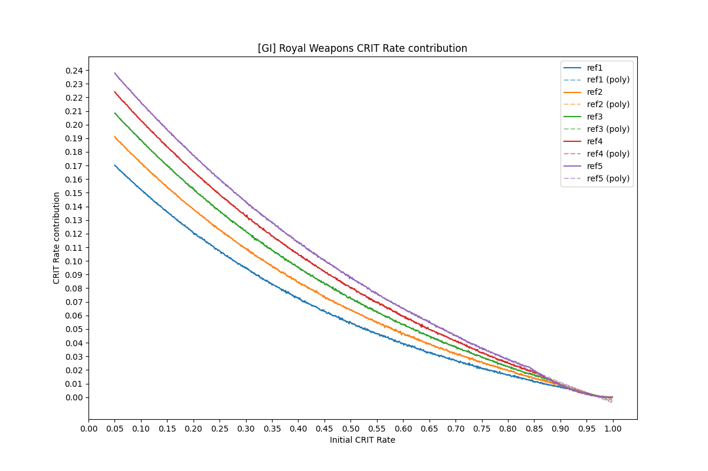

# Royal Weapons CRIT Rate contribution
 [GI] This is a simulation to calculate the effective CRIT Rate that the Royal Weapons passive effect contribute to the character in average situation. For this, 1M hits were simulated with different base CRIT rates, from 5% to 100% with a step of 0.1%.

The results of the simulation are seen in this graph:
 