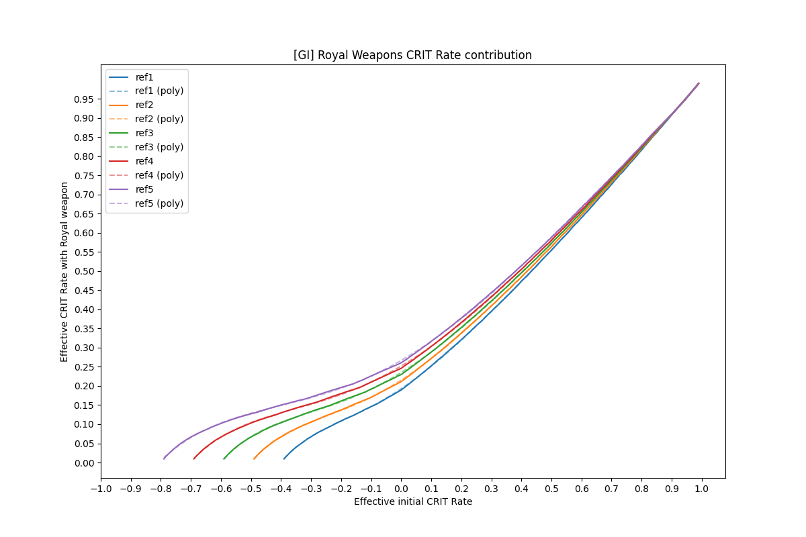
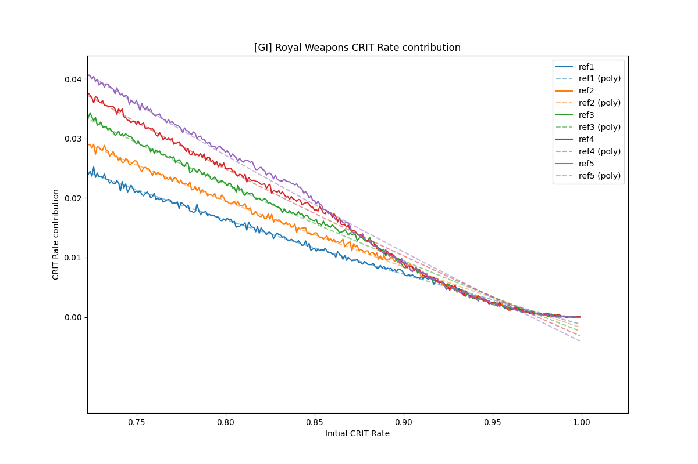

# Royal Weapons CRIT Rate contribution
 [GI] This is a simulation to calculate the effective CRIT Rate that the Royal Weapons passive effect contribute to the character in average situation. For this, 1M hits were simulated with different base CRIT rates, from 5% to 100% with a step of 0.1%.

The results of the simulation are seen in this graph:
 

 Then, the data where described using polynomial functions (results are saved in [This File](./results/polyfunctions.txt)).
Where `x` is the character Base CRIT Rate (from 0 to 1):
```
ref1(x)=-0.10158034117292747*x^3+0.31101509708848735*x^2+-0.4000198511105707*x^1+0.18932855038352558
ref2(x)=-0.10114100798963055*x^3+0.31549951098707774*x^2+-0.42777398106120645*x^1+0.21160958631034335
ref3(x)=-0.0973317320403049*x^3+0.3109264569837878*x^2+-0.4462218801782434*x^1+0.23015547899566594
ref4(x)=-0.09305456817824306*x^3+0.30332830972277874*x^2+-0.45976802242978737*x^1+0.24621017771906156
ref5(x)=-0.08877667311982003*x^3+0.29461590134457105*x^2+-0.47051978617321616*x^1+0.26049964486333793
```

With higher CRIT Rate values (>85%) these functions lose accuracy (at this point the data doesn't seem to describe the same polynomial pattern), and about the >97% CRIT Rate the result can be a negative number, just assume this means 0% contribution. This can be seen in the following image:

To correct this I would have to use a higher degree polynomial regression or split the data in two parts (like `[0-0.85)` and `(0.85-1]` )and describe it with different functions, but won't do it by now, just to simplify the things.